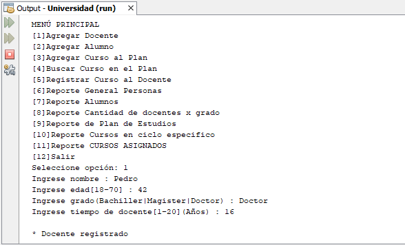

# Sistema de una universidad
Sistema sobre una Universidad con herencia múltiple donde se puede registrar un docente, registrar un alumno, registrar un curso al plan de estudios, buscar un curso en el plan de estudios, registrar un curso a un docente, listar las personas registradas, listar los alumnos registrados, mostrar la cantidad de docentes registrados por grado de educación, mostrar el plan de estudios, mostrar los cursos según un ciclo indicado y mostrar los cursos ya asignados a docentes, **19/12/19**.

<strong>Imagen:</strong> Menú principal - Agregar docente.

